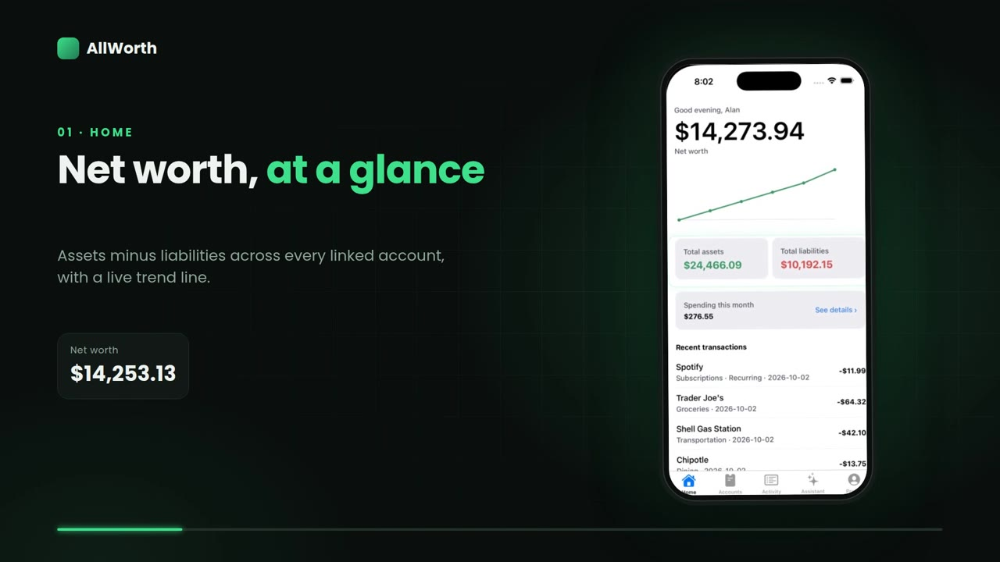
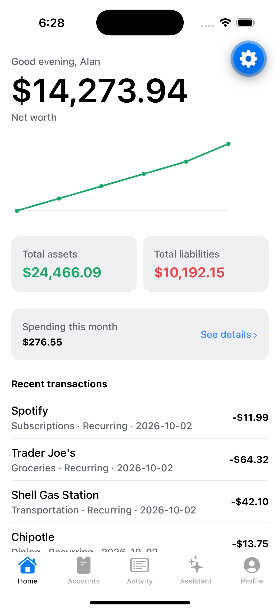
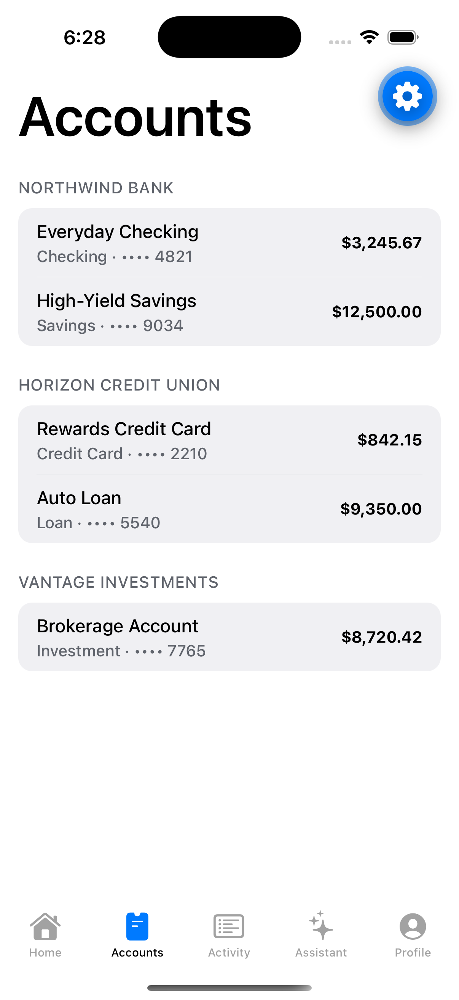
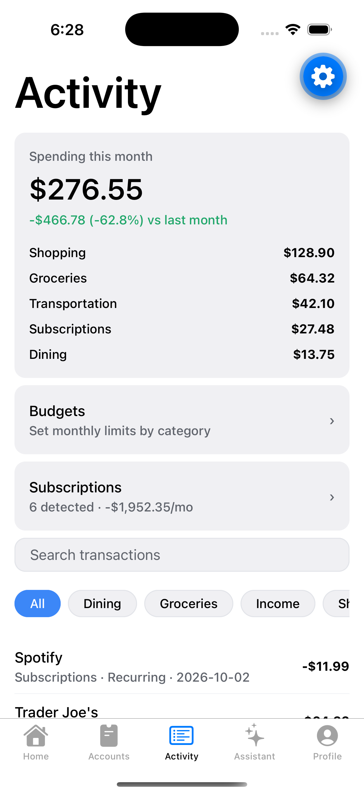
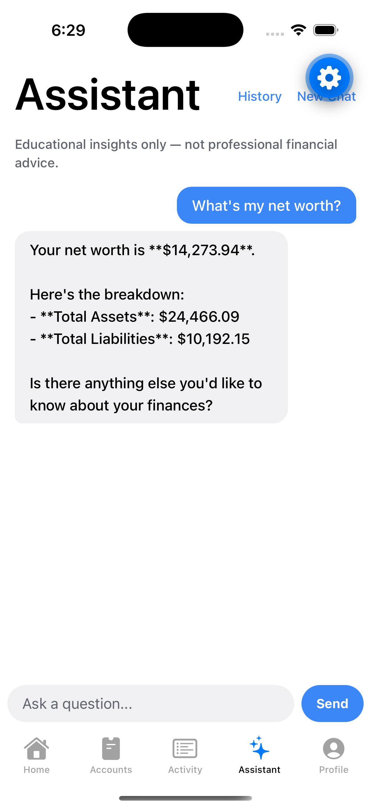

# AllWorth

A full-stack personal finance app: a React Native (Expo) mobile client backed
by a FastAPI + PostgreSQL API, with Firebase authentication, Plaid Sandbox
bank-account linking, and an AI assistant (Claude) that answers questions
about the signed-in user's own financial data using a restricted set of
read-only tools — no unrestricted database access.

**Live app:** https://allworth-mobile.vercel.app — the same Expo codebase,
exported for web and deployed on Vercel.
**Live API:** https://allworth-api.onrender.com (free tier — the first
request after a period of inactivity can take 30-50s while it spins up)

[](https://allworth-mobile.vercel.app/#tour)

*40-second walkthrough: net worth, accounts, activity, budgets, subscriptions
and the AI assistant.*

## Screenshots

| Home | Accounts | Activity |
|---|---|---|
|  |  |  |

| Budgets | Assistant |
|---|---|
|  |  |

Captured against the live deployed backend with seeded demo data.

## Features

- **Net worth tracking** — a single dashboard combining checking, savings,
  credit, investment, and loan accounts, with historical trend snapshots
- **Transaction activity** — searchable, filterable by category, with
  automatic duplicate-charge and recurring-subscription detection
- **Budgets** — set a monthly limit per category and track spend against it,
  with over-budget warnings
- **Bank connections** — link accounts via Plaid Sandbox; disconnecting a
  bank soft-deletes its accounts everywhere (net worth, budgets, the AI
  assistant, daily summaries) while preserving transaction history
- **Daily summary notifications** — an opt-in daily digest of spending,
  unusually large transactions, and budget warnings, with amounts hidden
  until opened
- **AI assistant** — ask questions in plain language ("What's my net worth?",
  "Show my subscriptions") and get answers grounded in the user's real data,
  with a clear "not professional financial advice" disclaimer
- **Dark mode**, accessibility-audited screens, and consistent
  loading/empty/error states throughout

## Tech Stack

**Mobile**
- React Native + Expo, TypeScript, Expo Router
- TanStack Query for server state
- Firebase Authentication (client SDK)

**Backend**
- FastAPI, SQLAlchemy, Alembic migrations
- PostgreSQL
- Firebase Admin SDK for token verification
- Plaid Sandbox API, with access tokens encrypted at rest (Fernet)
- Anthropic Claude API for the AI assistant, restricted to a fixed set of
  read-only, per-user-scoped tools
- Pytest (28 tests covering tools, auth, budgets, chat, daily summaries,
  models, and spending calculations)

**Infrastructure**
- Deployed on Render (web service + managed PostgreSQL) from a single
  `render.yaml` Blueprint, with Alembic migrations running automatically on
  every deploy

## How it's built

One TypeScript codebase targets iOS, Android and web. Expo Router handles
navigation on all three; web-only pieces (the marketing landing page, the
Firebase web config, tab bar) live in `*.web.tsx` / `*.web.ts` files that
Metro picks automatically. The web build is a static export
(`expo export --platform web`) served by Vercel, and talks to the same
FastAPI backend as the mobile app. Production CORS is restricted to the
deployed origin through the `CORS_ALLOWED_ORIGINS` environment variable.

Request flow: the client signs in with Firebase, attaches the ID token to
every API call, and the backend verifies it with the Firebase Admin SDK and
scopes every query to that user.

## Architecture notes

- **Per-user data isolation** is enforced at the query level on every
  endpoint, not just at the auth boundary.
- **Disconnecting a bank account** is a soft-delete (`sync_status =
  "disconnected"`) rather than a hard delete, so history is preserved, but
  every query that touches accounts — net worth, budgets, transactions, the
  AI assistant's tools, daily summaries — explicitly excludes disconnected
  accounts so stale balances never leak into the numbers the user sees.
- **The AI assistant** cannot query the database directly. It calls a fixed
  set of tool functions (`get_net_worth`, `get_account_balances`,
  `get_recent_transactions`, `get_spending_by_category`,
  `compare_spending_periods`, `get_subscriptions`, `find_large_transactions`),
  each of which is itself scoped to the authenticated user's own data.

## Project Structure

```
allworth/
├── mobile/             # React Native (Expo) app
│   └── src/
│       ├── app/        # Screens (Expo Router)
│       ├── components/ # Shared UI components
│       ├── hooks/       # TanStack Query hooks per domain
│       └── api/         # API client
├── backend/             # FastAPI backend
│   └── app/
│       ├── routers/     # API endpoints by domain
│       ├── models/      # SQLAlchemy models
│       ├── ai/           # Claude assistant + its restricted tool set
│       ├── scripts/      # Seed script for demo data
│       └── utils/        # Spending/net-worth/date calculation helpers
├── docs/
│   └── screenshots/
└── render.yaml           # Render Blueprint (API + managed Postgres)
```

## Running locally

**Backend**
```bash
cd backend
python3 -m venv venv && source venv/bin/activate
pip install -r requirements.txt
cp .env.example .env   # fill in your own Firebase, Plaid, and Anthropic credentials
docker compose up -d   # starts local Postgres
alembic upgrade head
uvicorn app.main:app --reload
```

**Mobile**
```bash
cd mobile
npm install
npx expo start
```

By default the app points at `http://127.0.0.1:8000`. To point it at the
deployed backend instead, run:
```bash
EXPO_PUBLIC_API_BASE_URL=https://allworth-api.onrender.com npx expo start
```

**Tests**
```bash
cd backend
pytest
```

## License

See LICENSE file.
